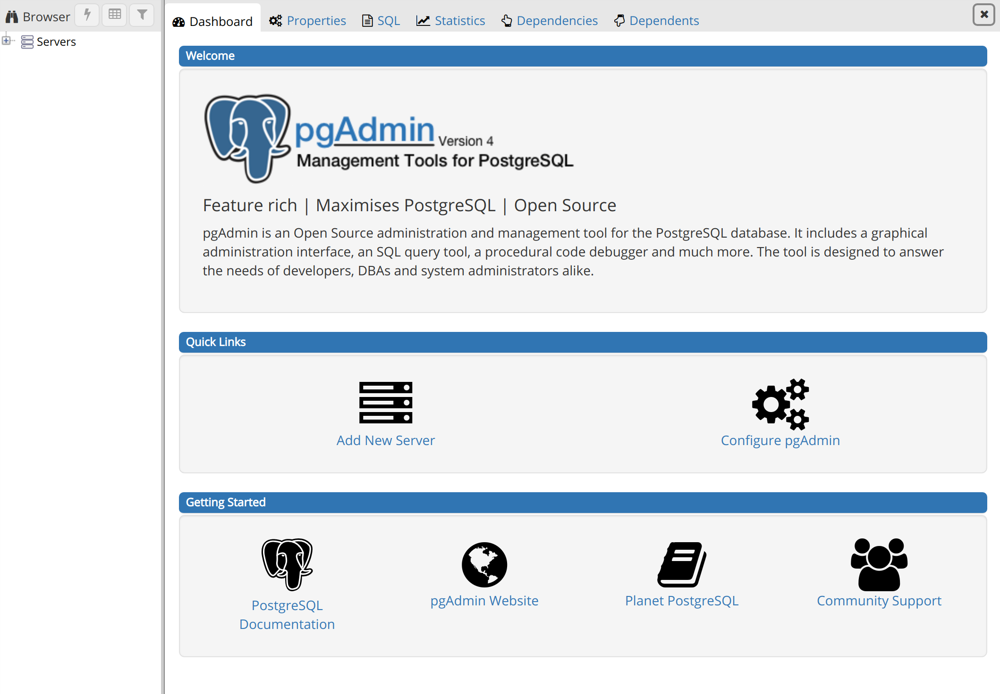

# postgresql-with-docker

<!---These are examples. See https://shields.io for others or to customize this shield set. You might want to include dependencies, project status and license information here--->


<!--

-->


> This project aims to automate the implementation of a [PostgreSQL](https://www.postgresql.org/) and [PgAdmin](https://www.pgadmin.org/) environment on a local machine using [Docker](https://docs.docker.com/) and [docker-compose](https://docs.docker.com/compose/) containers.

> With it we can perform database implementation tests, SQL commands and much more.

> Great option for studies.


## 💻 Skills

 
---

## 💻 Prerequisites

Before starting, make sure you've met the following requirements:
<!---These are example requirements only. Add, duplicate or remove as needed--->
* You have installed [Docker](https://docs.docker.com/) and [docker-compose](https://docs.docker.com/compose/).
* You have a `<Windows/Linux/Mac>` machine.


## 🚀 Installing 

To install, follow these steps using the terminal:

    1- Clone the repository:

    ```bash
    git clone https://github.com/jmreis/postgresql-with-docker.git
    ```

    2- Change to project directory:

    ```bash
    cd postgresql-with-docker
    ```

    3- Create your .env file:
    ```bash
    touch .env
    ```

    4- Setting variables on .env:
    ```bash
    POSTGRES-USERNAME="your-username"
    POSTGRES-PASSWORD="your-password"
    PGADMIN-DEFAULT-EMAIL="your-email"
    PGADMIN-DEFAULT-PASSWORD="your-password"
    ```


## ☕ Using

To use, follow these steps:

1- Build and run the environment:
    ```bash
    docker-compose up --build -d
    ```

2- Open the PgAdmin on your browser with http://localhost:15435



3- For stop the services use:
    ```bash
    docker-compose down
    ```

4- For start the service use:
    ```bash
    docker-composer up
    ```

## 📫 Contributing
<!---If your README is long or if you have any specific process or steps you want contributors to follow, consider creating a separate CONTRIBUTING.md file--->
To contribute, follow these steps:

1. Fork this repository.
2. Create a branch: `git checkout -b <branch_name>`.
3. Make your changes and commit them: `git commit -m '<message_commit>'`
4. Push to the original branch: `git push origin <project_name> / <local>`
5. Create the pull request.

Alternatively, see the GitHub documentation at [how to create a pull request](https://help.github.com/en/github/collaborating-with-issues-and-pull-requests/creating-a-pull-request ) .


[⬆ Back to top](#postgresql-with-docker)<br>
